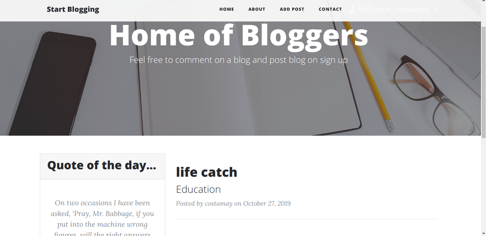

:satisfied:
# Blog
#### This project help users can find blogs and can also comment, Monday October 27th 2019 
#### By **OPIYO TITUS**&trade;

## Description
This is an app that allows users to create,comment,edit and submit theblog

## Project live site
  This is the live .[ Click for the demo](/)
 
## Features
* landing page containing random quotes
* All post are being displayed from the current ones
* posting and even commenting on other blogs
* user login/registration
* updates to profiles
*deletion and addition of posts

## Behavior Driven Development
| Behaviour | Input | Output |
| :---------------- | :---------------: | ------------------: |
| Display blogs | **On page load** | List of various  |blogs
| Display random quotes | **On Tab link click** | reedable quotes that change upon refreshing the page |
| Display profile | **Click profile page** | Redirected to a page with your profile |
| provide blog updates | **On page load** | thw writer can delete his or her blog posts|
| To add a blog  | **Click an add pitch** | Redirected to the blog collection form|

## Setup/Installation requirements
1.Clone or download and unzip the repository from github,https://github.com/costamay/Blog

2.You can use this command (git clone *my link*) to clone the project to your machine if you have git .

3.cd into the project folder and open in text editor.
4. install virtual environment then activate it

4.Then run chmod +x start.sh on your project directory.

5.Run  ./start.sh to launch the program.

## Technologies Used
* PYTHON
* PIP
* FLASK FRAMEWORK
* BOOTSTRAP
* CSS
* POSTGRESS
## Support and contact details
contact me @ titusouko@gmail.com
### License
The project is under[MIT license](/blob/master/LICENSE)
Copyright &copy; 2019.All rigths reserved
  